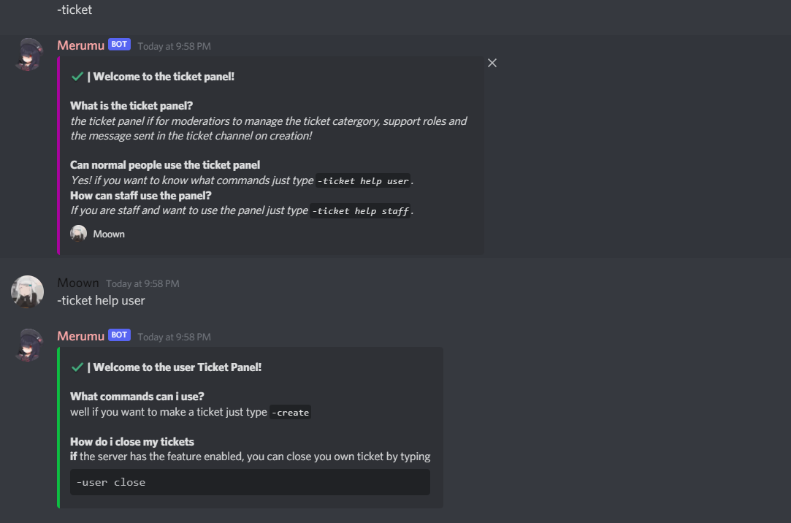

# Merumu

Merumu is a interactive music bot but with a twist as i implemnted moderation and fun commands!

## How to import

```bash
npm i git
git clone https://github.com/moonieqt/Merumu/new/Updates
npm i //install packages
node .
```

## Command example



## Requirements

```javascript

nodejs

discord.js v12.5.1

```

## Contributing
Pull requests are welcome. For major changes, please open an issue first to discuss what you would like to change.

Please make sure to update tests as appropriate.

Also please do NOT steal code from here, yes the bot is open source but any duplicates willl be removed accordingly , you can however get commands from here but if you do modify them so you can tell a difference.

## License
[](https://opensource.org/licenses/Apache-2.0)

